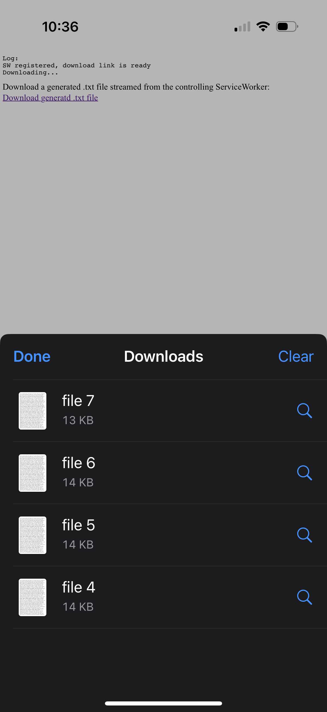
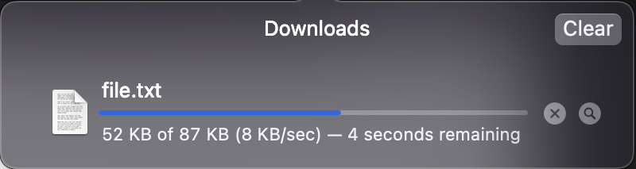

## Background

We're investigating a Safari WebKit bug where streaming downloads through a ServiceWorker function correctly on macOS but fail on iOS. On iOS devices, downloads are frequently interrupted and result in incomplete files being saved to the user's device. To properly test and reproduce this issue, you'll need a local HTTPS environment with self-signed certificates.

### \*Note: This behavior is not reproducable in a simulator.

## Prerequisites

- OpenSSL installed on your machine
- Node.js (if using the included development server)

## Generate Self-Signed Certificates

1. Open a terminal and navigate to the project directory
2. Get your local IP address & update the variable `localIp` in `https-server.js` with your IP.
3. Run the following command to generate your certificates:

```bash
openssl req -nodes -new -x509 -keyout server.key -out server.cert -subj "/CN=[YOUR_LOCAL_IP]" -days 365
```

## Install dependencies

```bash
npm install
```

## Run the application

```bash
npm run start
```

<table>
  <tr valign="top">
    <td width="50%">
      <h2>iOS</h2>
      <p>On iOS the download is incomplete.</p>
      
    </td>
    <td width="50%">
      <h2>macOS</h2>
      <p>On macOS the download completes.</p>
      
    </td>
  </tr>
</table>
